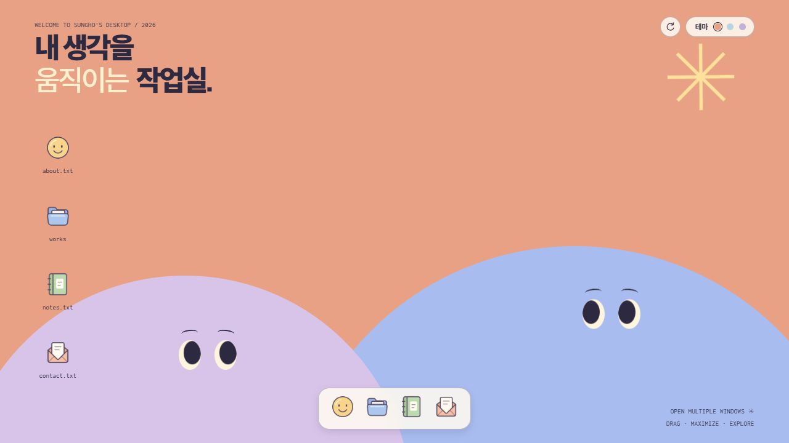
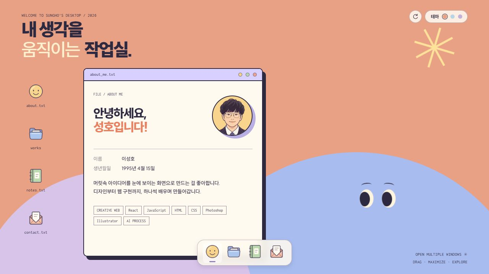

# Sungho | 내 생각을 움직이는 작업실

**소개와 작업물을 파일처럼 열어 보는 데스크톱 스타일 포트폴리오**

## 프로젝트 목표

소개와 작업물을 담을 공간을 컴퓨터 바탕화면처럼 만들어 보고 싶었습니다. 파일을 열고 창을 옮기는 익숙한 방식에 파스텔 색상과 작은 상호작용을 더해, 방문자가 직접 둘러볼 수 있는 포트폴리오를 만들었습니다.

## 제작 과정

1. **콘셉트 정하기** — 소개, 프로젝트, 메모장, 연락처를 각각의 파일로 나누고 바탕화면에서 열어 보는 구조를 정했습니다.
2. **화면 구성하기** — 파스텔 색상과 아이콘, 파일 창을 중심으로 시안을 구체화하고 화면을 구성했습니다.
3. **프로필 캐릭터 만들기** — 프로필 사진을 캐릭터로 바꾸고, 화면 분위기에 어울리도록 선과 색을 단순하게 다듬었습니다.
4. **기능 구현하기** — Next.js와 React로 창 이동·크기 조절, 테마 전환, 프로젝트 상세와 메모장을 구현했습니다.
5. **사용하면서 다듬기** — 메일 전송을 연결하고, PC와 모바일에서 확인하며 글과 여백, 창 높이, 버튼 배치를 조정했습니다.

콘셉트와 소개 내용, 원하는 화면의 방향은 직접 정했습니다. 코드 구현과 오류 수정에는 Codex의 도움을 받았고, 프로필 캐릭터는 AI 이미지 생성으로 제작했습니다. 실행 결과를 보며 수정할 부분을 정하고, 세부 조정을 반복했습니다.

### 사용 기술과 도구

| 도구 | 사용 목적 |
| --- | --- |
| Next.js + React | 페이지 구성과 창·아이콘·폼의 상태 관리 |
| TypeScript | 프로젝트 데이터와 컴포넌트의 타입 정의 |
| CSS | 테마, 창 배치, 반응형 화면과 애니메이션 구현 |
| SVG + Sharp | 아이콘 구성과 PNG 변환 |
| Web3Forms | 연락처의 메일 전송 |

## 포트폴리오 소개

`about_me.txt`에는 소개를, `works`에는 작업물을 담았습니다. `notes.txt`는 방문자가 자유롭게 쓸 수 있는 메모장이고, `contact.txt`에서는 메일을 보낼 수 있습니다. PC에서는 여러 창을 함께 열어 두고, 모바일에서는 한 번에 하나의 창을 볼 수 있습니다.

### 실제 실행 화면

**창을 열기 전 바탕화면**



**소개 창을 연 화면**



### 주요 기능

- **About Me:** 캐릭터 프로필, 기본 정보, 소개 문구와 사용 기술 표시
- **My Projects:** 작업물의 미리보기, 소개와 사용 기술을 확인할 수 있는 목록·상세 화면
- **창 조작:** 이동, 크기 조절, 최소화·최대화·닫기와 하단 독에서 복원
- **메모장:** 자유롭게 입력하고 방문자의 브라우저에만 자동 저장하는 `notes.txt`
- **메일 보내기:** 이름·답변받을 이메일·내용 입력과 실제 메일 전송
- **세 가지 테마:** Peach, Sky, Lilac 색상 전환
- **배경 상호작용:** 마우스나 터치를 따라가는 캐릭터의 시선과 천천히 회전하는 별
- **반응형 화면:** PC의 다중 창과 모바일의 단일 창 구성

프로젝트 목록은 네 개의 자리로 시작했습니다. 새 작업이 생기면 하나씩 추가해 나갈 예정입니다.

### 조작 방법

| 동작 | PC | 모바일 |
| --- | --- | --- |
| 파일 열기 | 바탕화면 아이콘 두 번 클릭 | 아이콘 한 번 터치 |
| 창 열기·복원 | 하단 독 아이콘 클릭 | 하단 독 아이콘 터치 |
| 창 이동 | 제목줄 드래그 | 화면에 맞춘 고정 배치 |
| 창 크기 조절 | 오른쪽·아래쪽 가장자리 또는 모서리 드래그 | 화면 크기에 맞춰 자동 배치 |
| 최소화·최대화·닫기 | 제목줄 오른쪽 버튼 클릭 | 제목줄 오른쪽 버튼 터치 |
| 프로젝트 상세 | 공개 프로젝트 카드 클릭 | 공개 프로젝트 카드 터치 |
| 테마 변경 | 오른쪽 위 색상 버튼 클릭 | 오른쪽 위 색상 버튼 터치 |

PC에서는 오른쪽 위 초기화 버튼으로 바탕화면 아이콘의 위치를 기본 상태로 되돌릴 수 있습니다.

## 로컬 실행

```bash
npm ci
npm run dev
```

개발 서버가 출력한 주소를 브라우저에서 열면 됩니다. 기본 주소는 `http://localhost:3000`입니다.

| 명령어 | 용도 |
| --- | --- |
| `npm run build` | 배포용 빌드 |
| `npm run start` | 빌드한 앱 실행 |
| `npm run lint` | 코드 검사 |

### 이메일 전송 설정

메일 전송을 사용하려면 [Web3Forms](https://web3forms.com/)에서 Access Key를 발급받고, 프로젝트 루트에 `.env.local` 파일을 만듭니다. [`.env.example`](.env.example)을 참고하세요.

```env
NEXT_PUBLIC_WEB3FORMS_ACCESS_KEY=발급받은_Access_Key
```

기존 구따지의 `VITE_WEB3FORMS_ACCESS_KEY` 이름도 지원합니다. 두 이름을 함께 설정하면 `NEXT_PUBLIC_WEB3FORMS_ACCESS_KEY`가 우선 적용됩니다.

설정 후 개발 서버를 다시 시작하세요. 키가 없으면 메일 전송 버튼이 비활성화되며, 나머지 기능은 사용할 수 있습니다. 메일은 Access Key에 연결된 주소로 전송되고, 폼에 입력한 이메일은 회신 주소로 사용됩니다.

Web3Forms Access Key는 브라우저 공개용입니다. `NEXT_PUBLIC_` 환경 변수는 빌드된 브라우저 코드에 포함되므로 비밀 정보 저장 용도로 사용하면 안 됩니다. 배포 시에도 빌드 환경에 키를 설정해야 합니다. 자세한 전송 동작은 [`docs/contact-form.md`](docs/contact-form.md)를 참고하세요.

`.env.local`, 설치 패키지, 빌드 결과, 원본 사진과 보관용 디자인 자료는 저장소에 포함하지 않습니다.
